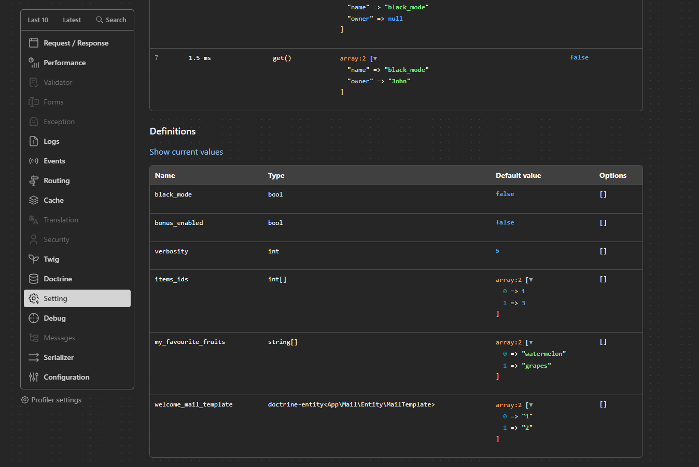

# Setting bundle

Setting bundle is a bundle of the Symfony framework that allows you to 
easily define, read and change settings.

Integrated with:
 - symfony cache
 - doctrine orm
 - symfony profiler
 - symfony serializer
 - twig

## Table of Contents
- [Installation & configuration](#installation--configuration)
- [Usage](#usage)
- [Data storages](#data-storages)
- [Data transformers](#data-transformers)
  - [Doctrine data transformer](#doctrinedatatransformer)
- [More effective user (setting owner) passing](#more-effective-user-setting-owner-passing)
- [Twig](#twig)
- [Symfony profiler](#symfony-profiler)

### Installation & configuration

1. Run composer require
```shell
composer require dwalczyk/setting-bundle
```

2. create file `config/dwalczyk_setting.yaml` and paste the contents from below:
```yaml
dwalczyk_setting:

  data_storage: 'DWalczyk\SettingBundle\Extension\Doctrine\DataStorage\DoctrineDataStorage'
  #cache: cache.app

  #definitions: []
```
3. Add to `config/doctrine.yaml`
```yaml
doctrine:
    orm:
        mappings:
            SettingBundle:
                is_bundle: true
                dir: 'Resources/config/doctrine'
                prefix: 'DWalczyk\SettingBundle\Extension\Doctrine\Entity'
                alias: SettingBundle
```
4. Create and execute migration
```shell
php bin/console doctrine:migrations:diff
php bin/console d:m:m
```
&nbsp;

### Usage
1. First we need to define the setting.

via php
```php
<?php

declare(strict_types=1);

namespace App;

use DWalczyk\SettingBundle\AbstractSettingExtension;
use DWalczyk\SettingBundle\SettingDefinition;

final class SettingExtension extends AbstractSettingExtension
{
    public function getDefinitions(): array
    {
        return [
            new SettingDefinition(name: 'black_mode', type: 'bool', defaultValue: false),
        ];
    }
}
```
or via yaml configuration
```yaml
dwalczyk_setting:
  definitions:

    black_mode:
        type: bool
        default_value: false
```

2. Now you can read or set value globally or per user.
```php
#[Route('/')]
public function test(SettingsInterface $settings): Response
{
    $settings->get('black_mode'); // false
    $settings->get('black_mode', 'John'); // false

    // set "global scope" value
    $settings->set('black_mode', true);

    $settings->get('black_mode'); // true
    $settings->get('black_mode', 'John'); // true

    // set "user scope" value
    $settings->set('black_mode', false, 'John');

    $settings->get('black_mode'); // true
    $settings->get('black_mode', 'John'); // false

    // ...
}
```
&nbsp;

### Data storages
Data storages are classes responsible for writing and reading previously saved settings.

Available built-in data storages:
- ```DWalczyk\SettingBundle\Extension\Doctrine\DataStorage``` - Doctrine ORM storage

You can create your custom data storage, just create symfony service that implements
`DWalczyk\SettingBundle\DataStorageInterface` and insert its name to configuration.
```php
namespace App\DataStorage;

use DWalczyk\SettingBundle\DataStorageInterface;

class Custom implements DataStorageInterface
{
    public function read(string $name, ?string $ownerIdentifier): ?string
    {
        // TODO: Implement read() method.
    }

    public function write(string $name, ?string $value, ?string $ownerIdentifier): void
    {
        // TODO: Implement write() method.
    }
}
```
```yaml
dwalczyk_setting:

  data_storage: 'App\DataStorage\Custom'
```
&nbsp;

### Data transformers
Data transformers determine how to format data before writing and after reading from data storage.

They are also responsible for formatting the values from the "defaultValue" definition.

Built-in data transformers:
- `DoctrineDataTransformer` - handle doctrine types, [read more](#doctrinedatatransformer)
- `SerializerDataTransformer` - handle all types supported by symfony serializer
- `NativePhpSerializerDataTransformer` - handle all types supported by serialize/unserialize native php functions

By default, data transformers are loaded in the order:
1. `DoctrineDataTransformer`
2. `SerializerDataTransformer`

If you want to use `NativePhpSerializerDataTransformer` instead of `SerializerDataTransformer` add this code to your config:
```yaml
services:
  DWalczyk\SettingBundle\Extension\Core\DataTransformer\NativePhpSerializerDataTransformer:
    tags:
      - { name: 'dwalczyk_setting.data_transformer', priority: 1 }
```

Or create custom data transformer
```php
<?php

namespace App;

use DWalczyk\SettingBundle\DataTransformerInterface;
use Symfony\Component\DependencyInjection\Attribute\AsTaggedItem;

#[AsTaggedItem('dwalczyk_setting.data_transformer', priority: 2)]
class CustomDataTransformer implements DataTransformerInterface
{
    // implement required methods
}
```

#### DoctrineDataTransformer
Supported types:
- `doctrine-entity<fqcn/of/entity>` - single entity e.g. `doctrine-entity<App\Mail\Entity\MailTemplate>`
- `doctrine-entity<fqcn/of/entity>[]` - multiple entity e.g. `doctrine-entity<App\Mail\Entity\MailTemplate>[]`

&nbsp;

### More effective user (setting owner) passing
Implement `SettingOwnerInterface` in your security user class.
```php
class User implements UserInterface, PasswordAuthenticatedUserInterface, SettingOwnerInterface
{
    public function getSettingIdentifier(): string
    {
        return (string) $this->id;
    }

    ...
}
```
Now you are able to call:
```php
#[Route('/')]
public function test(SettingsInterface $settings): Response
{
    $settings->get('black_mode', $this->getUser());
    // or
    $settings->set('black_mode', true, $this->getUser());
    
    // ...
}
```
&nbsp;

### Twig
Functions:
```text
{{ setting(settingName) }}
```
&nbsp;

### Symfony profiler



